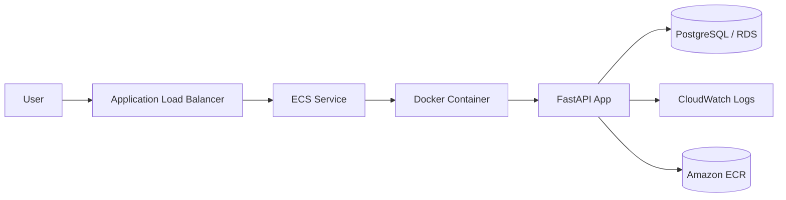

# TaskFlow Pro

TaskFlow Pro is a production-ready FastAPI web application for task management with:

- Secure authentication and authorization
- User and admin dashboards
- REST APIs
- PostgreSQL-ready SQLAlchemy models
- Cookie-based auth with CSRF protection for browser forms
- Docker, Docker Compose, CI/CD, and AWS deployment artifacts

## Local development

1. Create a virtual environment
2. Install dependencies from `requirements.txt`
3. Copy `.env.example` to `.env`
4. Run the app with Uvicorn

```bash
python3 -m venv .venv
source .venv/bin/activate
pip install -r requirements.txt
cp .env.example .env
uvicorn app.main:app --reload
```

Open:

- App: `http://127.0.0.1:8000`
- Docs: `http://127.0.0.1:8000/docs`

## Default demo credentials

- Admin: `admin@example.com` / `Admin@12345`
- Demo user: `maya@example.com` / `DemoPass123!`

## Docker

Build and run:

```bash
docker build -t taskflow-pro .
docker run --rm -p 8000:8000 --env-file .env taskflow-pro
```

Compose:

```bash
docker compose up --build
```

## Testing

```bash
pytest
```

## API

FastAPI generates OpenAPI docs automatically at:

- `/docs`
- `/redoc`

## Architecture



## AWS production flow

1. Developer writes code locally.
2. Code is pushed to GitHub.
3. GitHub Actions runs tests and builds a Docker image.
4. The image is pushed to Amazon ECR.
5. ECS pulls the image and starts a container.
6. An Application Load Balancer routes traffic to ECS tasks.
7. The FastAPI app serves HTML pages and REST APIs.

## AWS config files

- `deploy/aws/ecs-task-definition.json`
- `deploy/aws/deploy.sh`

## AWS values used in deployment

- AWS account ID: `810448722017`
- AWS region: `ap-south-1`
- ECR repository: `taskflow-pro`
- ECS cluster: `taskflow-pro-cluster`
- ECS service: `taskflow-pro-service`
- ECR image URI: `810448722017.dkr.ecr.ap-south-1.amazonaws.com/taskflow-pro:latest`

GitHub Secrets required:

- `AWS_ROLE_ARN`
- `AWS_ACCOUNT_ID`
- `ECR_REPOSITORY`
- `ECS_CLUSTER`
- `ECS_SERVICE`
